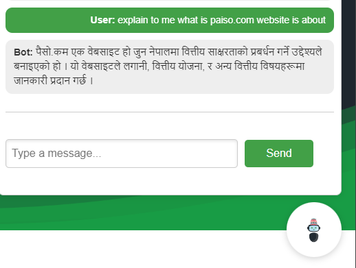
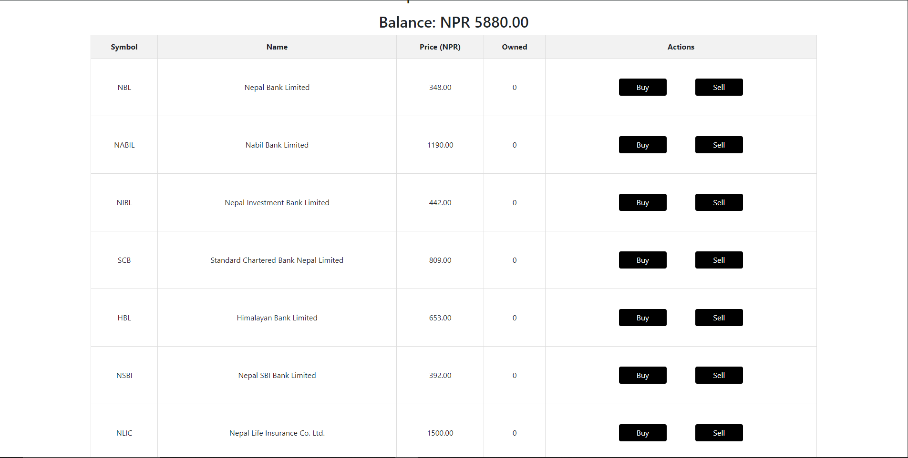
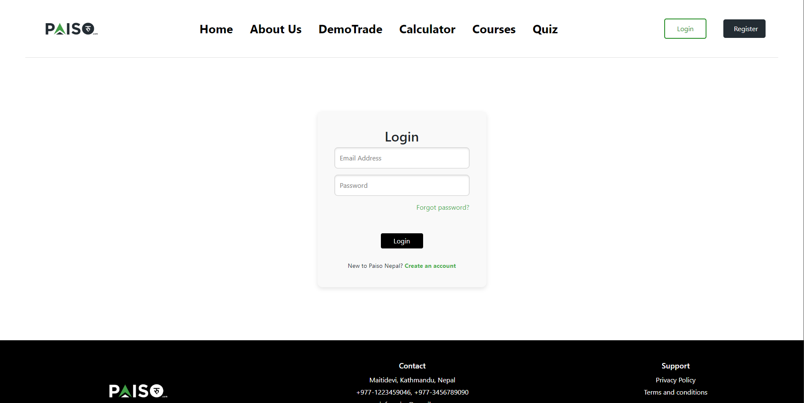
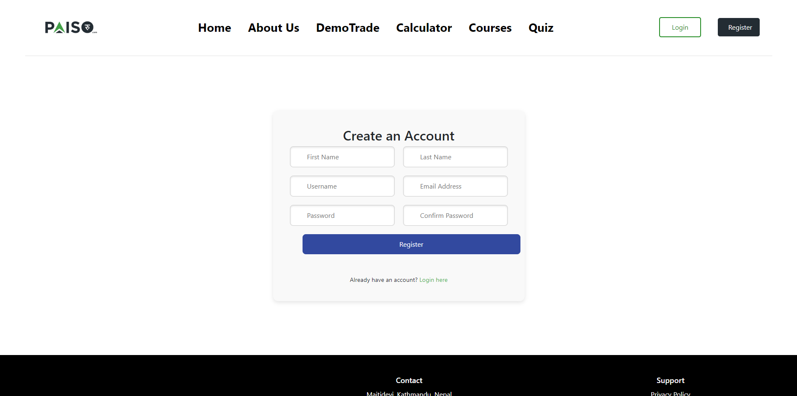

# Paiso.com - Phoenix Tech Fest Hackathon Project

Welcome to **Paiso.com**, our entry for the Phoenix Tech Fest Hackathon! We are a team of five passionate individuals who have come together to create a platform that empowers everyone with the tools and knowledge to achieve their financial aspirations.

## Team Members
- **Jyotsan Hamal** - AI Engineer
- **Sakshyam Sapkota** - UI/UX Designer, Presenter
- **Mandeep Chaudhary** - Frontend Developer
- **Lhakpa Tsheri Sherpa** - UI/UX Designer, Documentation, System Architect
- **Nikesh Shrestha** - Backend Engineer

## Project Overview

At **Paiso.com**, we believe that with the right resources, anyone can make smart investment choices and reach their financial goals. Our platform offers a range of features designed to simplify stock analysis, financial planning, and more:

### Key Features
- **Paiso.com Insights**: Provides data-driven analysis to guide your investment decisions.
- **Smart Invest**: Tools to help you make informed investment choices.
- **Financial Mastery Courses**: Educational content tailored for beginner, intermediate, and advanced users.
- **Hari - The Nepali Chatbot**: Our friendly chatbot Hari is here to assist you throughout the website, guiding you through courses and answering questions—all in Nepali.
- **DemoTrade**: Practice buying and selling stocks with virtual money. Users can also earn reward points and participate in daily quizzes.

## Installation Guide

To set up the project locally, follow these steps:
### Clone the repo
    ```
    git clone "repo url"
    ```

### Backend Setup
1. Navigate to the backend directory:
   ```
   cd backend
   ```
2. Create a virtual environment and activate it:
    ```
    python -m venv venv
    ./venv/Scripts/activate
    ```
3.  Install the required dependencies:
    ```
    pip install -r requirements.txt
    ```
4.  Create a .env file inside the backend folder with the following keys:
    ```
    SECRET_KEY=your_django_secret_key
    DEBUG=True
    DATABASE_URL="your_postgresql_database_url"
    EMAIL="your_email_for_verification_otp"
    PSWD="your_email_password"
    GOOGLE_API_KEY="your_google_gemini_api_key"
5.  Run the server:
    ```
    python ./manage.py runserver
    ```
### Frontend Setup
1.    Navigate to the frontend directory:
    ```
    cd .. 
    ```
    ```
    cd frontend
    ```
2.  Install the dependencies:
    ```
    npm i
    ```
3.  Start the development server:
    ```
    npm run dev
    ```
### Conclusion
Paiso.com is more than just a website—it's a comprehensive platform designed to empower users with financial literacy and investment tools. We're excited to present our project at the Phoenix Tech Fest and hope you find it as valuable as we do!

Thank you for checking out our project! If you have any questions or feedback, feel free to reach out to any of our team members.


## Project Glimpse

Here are some snapshots from the Paiso.com project:

### About Page


### Chatbot Interface


### Courses Overview


### DemoTrade Feature


### Home Page


### Login Page


### Register Page

